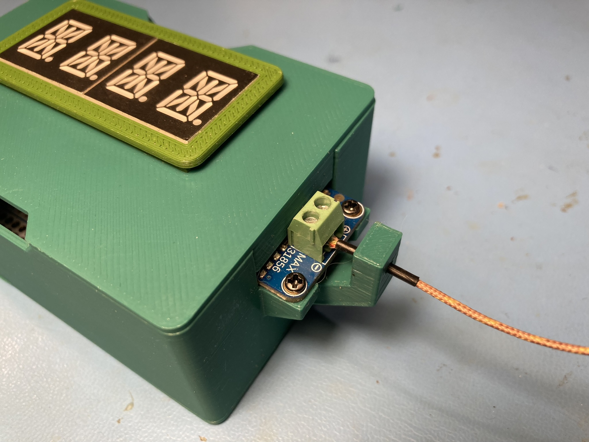
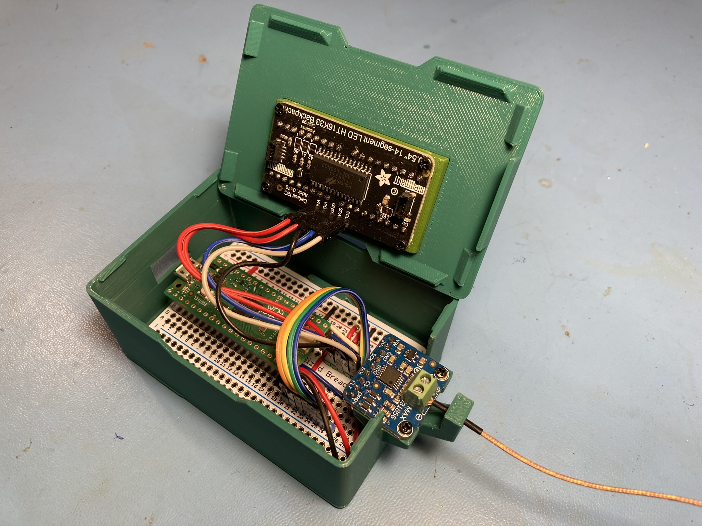
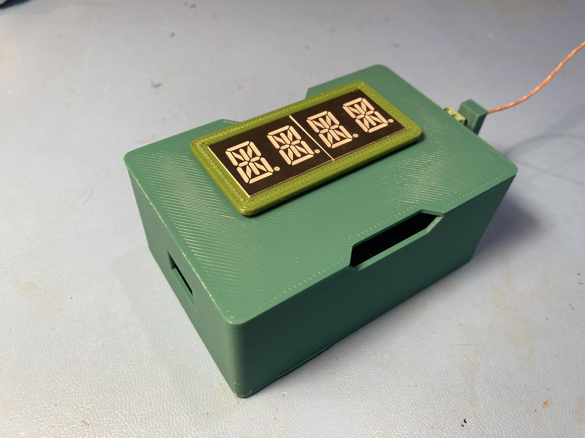
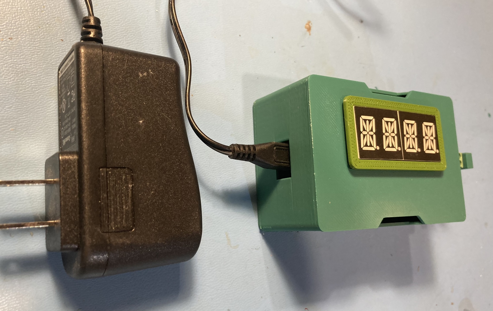

# Thermocouple Monitor
This repository describes the components needed to make a thermocouple monitor, which reads the temperature from a K-type thermocouple and shows the results on a LED display.

## Hardware
The design uses the following hardware components:
1. [Raspberry Pi Pico](https://www.adafruit.com/product/5525)
1. [Adafruit Universal Thermocouple Amplifier MAX31856 Breakout](https://www.adafruit.com/product/3263)
1. [Quad Alphanumeric Display - Blue 0.54" Digits w/ I2C Backpack](https://www.adafruit.com/product/1912)
1. [Thermocouple Type-K Glass Braid Insulated](https://www.adafruit.com/product/270)
1. [Adafruit Perma-Proto Half-sized Breadboard PCB](https://www.adafruit.com/product/1609)

## Schematic
The [schematic](schematic/thermocouple-measurement-unit.pdf) shows how everything is connected.

## 3D printed enclosure
The enclosure design is a derivative of the [3DP case for an Adafruit half-size Perma-Proto Half-Sized breadboard](https://www.printables.com/model/37200-perma-proto-feather-case).  

The modifications include:
1. side hole to plug usb cable into Raspberry Pi Pico
1. top hole to fit a bezel for the HT16K33 Backpack PCB
1. mount for the Adafruit Universal Thermocouple Amplifier MAX31856 Breakout
1. strain relief for thermocouple cable

3D print files for the enclosure are found in the [3dp folder](3dp/).  A [7 or 14 Segment Display Panel Mount](https://www.printables.com/en/model/628477-7-or-14-segment-display-panel-mount) is also a 3D print. 

## CircuitPython Code
A few lines of CircuitPython [code](code/code.py) is used to read the temperature values from thermocouple board and display the values on the display.  The code uses two Adafruit CircuitPython libraries:
1. adafruit_ht16k33
1. adafruit_max31856

These two libraries need to loaded into the CircuitPython filesystem on the Raspberry Pi Pico.

## Wiring and Assembly
The breakout boards are connected to the PCB using [male header pins](https://www.adafruit.com/product/3009) and [female-to-female jumper wires](https://www.adafruit.com/product/1951).  Solid 22 AWG wire is used to make point-to-point connections on the PCB, between the Raspberry Pi Pico and the male header pins.  M2x5mm screws are used to attach the display backpack to the 3DP display mount.  The same type of screws are used to attach the thermocouple breakout to the 3DP frame.  Everything else snaps together.  The PCB may not be a tight snap fit to the bottom 3DP piece.  In that case two addition M2x5mm screws can be used to secure it.  The thermocouple feeds through the stain relief and then screws into the 2 pin terminal block.  The thermocouple wires are polarized.  You have a 50/50 chance of getting the right orientation.  If the temperature reads incorrectly swap the wires in the terminal block.

## Powering the unit 
A wall adapter providing 5V to a micro-USB connector is a good way to power the unit.

